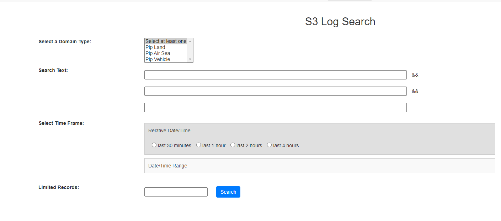

# Web application for AWS log search utilizing the S3 SDK

This web application is designed for searching S3 logs. FluntD uploads log gz files to the S3 bucket. The application enables the production support team to perform free-text searches for gz files stored in the S3 bucket. Please refer to the diagram below for details.

### 1. Requirements
This S3 log search is built on an existing application deployed in Kubernetes, leveraging the Spring Framework, FreeMarker, and Bootstrap, along with jQuery technology. For S3 bucket file search, the AWS S3 SDK is used here.

### 2. Design
To create an application that supports searching various application files, the S3 object file path must adhere to the convention {BUCKET_NAME}/logs/{application}/yyyyMMdd/*.gz. The resolution of the {application} token is implemented within the class file [Domain.java](src/main/java/pax/tecs/psconfig/web/record/Domain.java). Any future additions of application files will require a straightforward modification in that file.

The main implementation file for business logic is [S3LogSearchController.java](src/main/java/pax/tecs/psconfig/web/controller/S3LogController.java), and the file responsible for spring framework wiring up the AWS S3Client [S3LogBeanConfigure.java](src/main/java/pax/tecs/ws/config/S3LogBeanConfigure.java). The front-end web page is [s3logs](src\main\resources\templates\s3logs.ftlh) 

The search criteria support entries for both relative time and range timeframes.

*Figure 1: Log Search Screen
